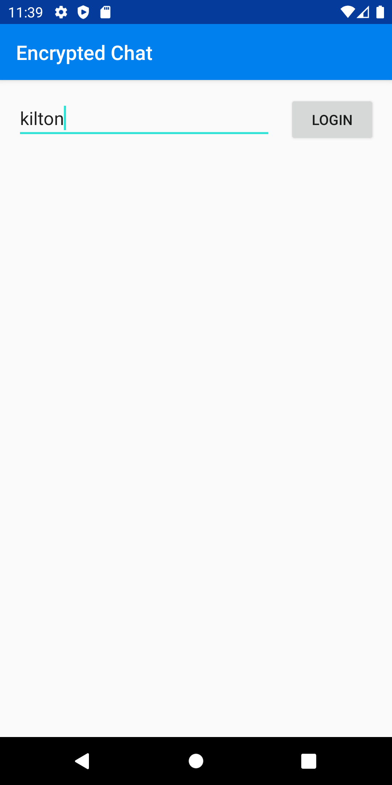
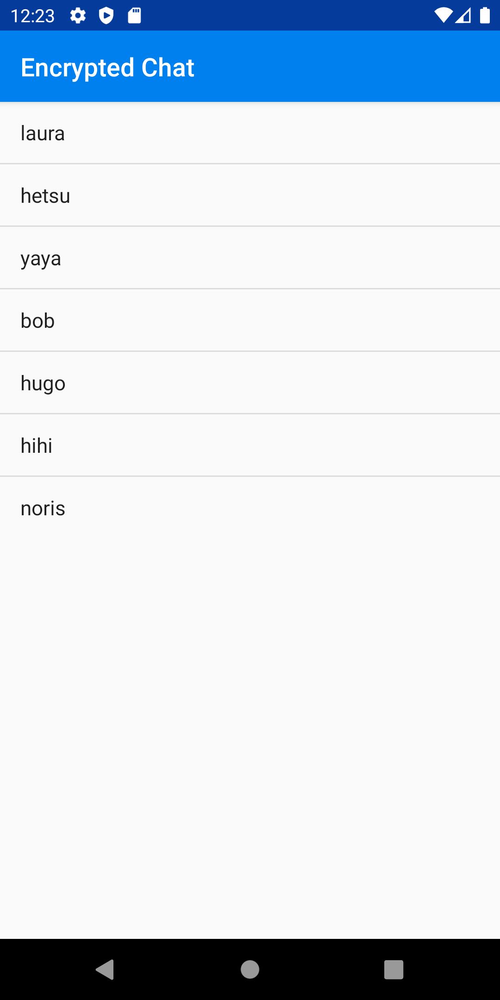
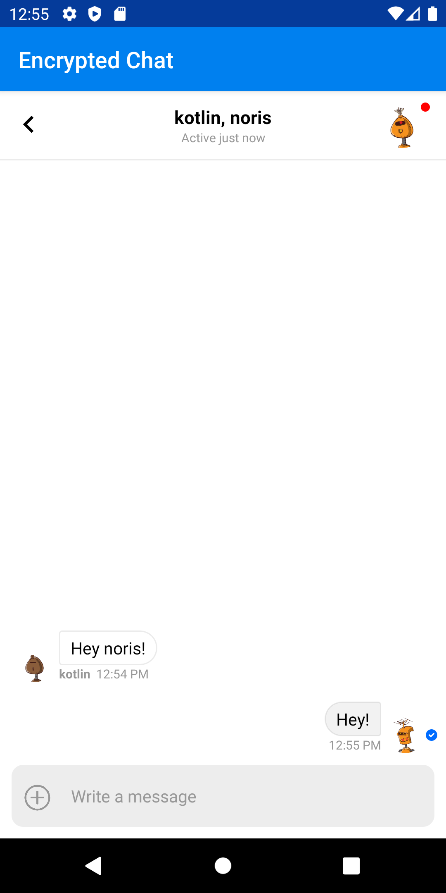

# Android Encrypted Chat with Stream

In this tutorial, we'll build encrypted chat with Android. To do this, we'll combine [Stream Chat](https://getstream.io/chat/) and [Virgil Security](https://virgilsecurity.com/). Both Stream and Virgil make it easy to build a solution with great security with all the features you expect. These two services allow developers to integrate chat that is zero knowledge to your backend or Stream's. The application embeds Virgil Security's [eThree Kit](https://github.com/VirgilSecurity/virgil-e3kit-kotlin) with Stream Chat's [Android](https://github.com/GetStream/stream-chat-android) components. All source code for this application is available on [GitHub](https://github.com/psylinse/stream-android-encrypted-chat).

## What is end-to-end encryption?

End-to-end encryption means that messages sent between two people can only be read by them. To do this, the message is encrypted before it leaves a user's device, and can only be decrypted by the intended recipient.

Virgil Security is a vendor that allows us to create end-to-end encryption via public/private key technology. Virgil provides a platform and Android SDK that allows us to securely create, store, and provide robust end-to-end encryption.

During this tutorial, we will create a Stream Chat app that uses Virgil's encryption to prevent anyone except the intended parties from reading messages. No one in your company, nor any cloud provider you use, can read these messages. Even if a malicious person gained access to the database containing the messages, all they would see is encrypted text, called ciphertext.

## Building an Encrypted Chat application

To build this application we'll mostly rely on two libraries, Stream Chat Android and Virgil Security Kotlin. Our final product will encrypt text on the device before sending a message. Decryption and verification will both happen in the receiver's device. Stream's Chat API will only see ciphertext, ensuring our user's data is never seen by anyone else, including us.

To accomplish this, the app performs the following steps:

1. A user authenticates with your backend.
2. The user's app requests a Stream auth token and API key from the backend. The
   Android app creates a
   [Stream Chat Client](https://getstream.io/chat/docs/#init_and_users) for that user.
3. The user's app requests a Virgil auth token from the backend and registers
   with Virgil. This generates their private and public key. The private key is stored locally, and the public key is stored in Virgil.
4. Once the user decides who they want to chat with the app creates and
   joins a
   [Stream Chat Channel](https://getstream.io/chat/docs/#initialize_channel).
5. The app asks Virgil for the receiver's public key.
6. The user types a message and sends it to Stream. Before sending, the app
   passes the receiver's public key to Virgil to encrypt the message. The message is relayed through Stream Chat to the receiver. Stream receives ciphertext, meaning they can never see the original message.
7. The receiving user decrypts the sent message using Virgil. When the message
   is received, app decrypts the message using the Virgil and this is passed along to Stream's UI components. Virgil verifies the message is
   authentic by using the sender's public key.

While this looks complicated, Stream and Virgil do most of the work for us. We'll use Stream's out of the box UI components to render the chat UI and Virgil to do all of the cryptography and key management. We simply combine these services. 

The code is split between the Android frontend contained in the `android` folder and the Express (Node.js) backend is found in the `backend` folder. See the `README.md` in each folder to see installing and running instructions. If you'd like to follow along with running code, make sure you get both the `backend` and `android` running before continuing.

Let's walk through and look at the important code needed for each step.

## Prerequisites

Basic knowledge of Android (Kotlin) and Node.js is required to follow this tutorial. This code is intended to run locally on your machine. 

We use [Anko](https://github.com/Kotlin/anko/wiki/Anko-Coroutines) to simplify our asynchronous code. Please note this library was recently [deprecated](https://github.com/Kotlin/anko/blob/master/GOODBYE.md). There are also likely bugs in our async implementation. However, we chose to keep the noise to a minimum in this tutorial by leveraging Anko and keeping async simple. Please use best practices for asynchronous code.

You will need an account with [Stream](https://getstream.io/accounts/signup/) and [Virgil](https://dashboard.virgilsecurity.com/signup). Once you've created your accounts, you can place your credentials in `backend/.env` if you'd like to run the code. You can use `backend/.env.example` as a reference for what credentials are required. You also need to place your Stream API key in `MainActivity.kt:60`.

## Step 0. Setup the Backend

For our React frontend to interact with Stream and Virgil, the application provides three endpoints:

* `POST /v1/authenticate`: This endpoint generates an auth token that allows the Android app to communicate with `/v1/stream-credentials` and `/v1/virgil-credentials`. To keep things simple, this endpoint allows the client to be any user. The frontend tells the backend who it wants to authenticate as. In your application, this should be replaced with your API's authentication endpoint.

* `POST /v1/stream-credentials`: This returns the data required for the Android app to communicate with Stream. In order return this info we need to tell Stream this user exists and ask them to create a valid auth token:
  
  ```javascript
  // backend/src/controllers/v1/stream-credentials.js
  exports.streamCredentials = async (req, res) => {
    const data = req.body;
    const apiKey = process.env.STREAM_API_KEY;
    const apiSecret = process.env.STREAM_API_SECRET;
  
    const client = new StreamChat(apiKey, apiSecret);
  
    const user = Object.assign({}, data, {
      id: `${req.user.sender}`,
      role: 'admin',
      image: `https://robohash.org/${req.user.sender}`,
    });
    const token = client.createToken(user.id);
    await client.updateUsers([user]);
    res.status(200).json({ user, token, apiKey });
  }
  ```
  
  The response payload has this shape:
  
  ```json
  {
    "apiKey": "<string>",
    "token": "<string>",
    "user": {
      "id": "<string>",
      "role": "<string>",
      "image": "<string>"
    }
  } 
  ```
  
   * `apiKey` is the stream account identifier for your Stream instance. Needed to identify what account your frontend is trying to connect with.
   * `token` JWT token to authorize the frontend with Stream.
   * `user`: This object contains the data that the frontend needs to connect and render the user's view.

* `POST /v1/virgil-credentials`: This returns the authentication token used to connect the frontend to Virgil. We use the Virgil Crypto SDK to generate a valid auth token for us:
  
  ```javascript
  // backend/src/controllers/v1/virgil-credentials.js
  async function getJwtGenerator() {
    await initCrypto();
  
    const virgilCrypto = new VirgilCrypto();
    // initialize JWT generator with your App ID and App Key ID you got in
    // Virgil Dashboard.
    return new JwtGenerator({
      appId: process.env.VIRGIL_APP_ID,
      apiKeyId: process.env.VIRGIL_KEY_ID,
      apiKey: virgilCrypto.importPrivateKey(process.env.VIRGIL_PRIVATE_KEY),
      accessTokenSigner: new VirgilAccessTokenSigner(virgilCrypto)
    });
  }
  
  const generatorPromise = getJwtGenerator();
  
  exports.virgilCredentials = async (req, res) => {
    const generator = await generatorPromise;
    const virgilJwtToken = generator.generateToken(req.user.sender);
  
    res.json({ token: virgilJwtToken.toString() });
  };
  ```
  
  In this case, the frontend only needs the auth token.

* `GET /v1/users`: Endpoint for returning all users. This exists just to get a list of people to chat with. 

## Step 1. User Authenticates With Backend

First, we log in to a user. To keep things simple we'll just have an empty form that lets you log in with any name:



This is a simple form that takes any arbitrary name, effectively allowing us to log in as anyone. We set this up in our `MainActivity`:

```kotlin
// io/getstream/encryptedchat/MainActivity.kt:18
class MainActivity : AppCompatActivity() {
    override fun onCreate(savedInstanceState: Bundle?) {
        super.onCreate(savedInstanceState)

        val binding: ActivityMainBinding =
            DataBindingUtil.setContentView(this, R.layout.activity_main)
        binding.lifecycleOwner = this

        binding.submit.setOnClickListener {
            val user: String = binding.user.text.toString()
            val context = this

            doAsync {
                val authToken = signIn(user)
                val streamToken = getStreamToken(authToken)
                val virgilToken = getVirgilToken(authToken)
                initVirgil(it.context, virgilToken)

                uiThread { context ->
                    initStream(user, streamToken)
                    val intent = UsersActivity.newIntent(context, user, authToken, virgilToken)
                    startActivity(intent)
                }
            }
        }
    }
    // ...
}
```

And the layout:

```xml
<!-- layout/activity_main.xml -->
<?xml version="1.0" encoding="utf-8"?>
<layout xmlns:android="http://schemas.android.com/apk/res/android">

    <androidx.constraintlayout.widget.ConstraintLayout xmlns:app="http://schemas.android.com/apk/res-auto"
        xmlns:tools="http://schemas.android.com/tools"
        android:layout_width="match_parent"
        android:layout_height="match_parent"
        tools:context="io.getstream.encryptedchat.MainActivity">

        <EditText
            android:id="@+id/user"
            android:layout_width="0dp"
            android:layout_height="wrap_content"
            android:layout_marginStart="16dp"
            android:layout_marginLeft="16dp"
            android:layout_marginTop="16dp"
            android:ems="10"
            android:hint="Username"
            android:inputType="textPersonName"
            app:layout_constraintEnd_toStartOf="@+id/submit"
            app:layout_constraintHorizontal_bias="0.5"
            app:layout_constraintStart_toStartOf="parent"
            app:layout_constraintTop_toTopOf="parent" />

        <Button
            android:id="@+id/submit"
            android:layout_width="wrap_content"
            android:layout_height="wrap_content"
            android:layout_marginStart="16dp"
            android:layout_marginEnd="16dp"
            android:text="Login"
            app:layout_constraintBaseline_toBaselineOf="@+id/user"
            app:layout_constraintEnd_toEndOf="parent"
            app:layout_constraintHorizontal_bias="0.5"
            app:layout_constraintStart_toEndOf="@+id/user" />

    </androidx.constraintlayout.widget.ConstraintLayout>
</layout>
```

When we submit the form we sign into our backend, get a Stream and Virgil frontend auth token, generate our private key and register with Virgil, then start our next activity. We'll look at each of these in turn.

Let's see our sign in and token generation:

```kotlin
// io/getstream/encryptedchat/BackendService.kt:16
fun signIn(user: String): String {
    return post("/v1/authenticate", mapOf("user" to user))
        .getString("authToken")
}

fun getVirgilToken(authToken: String): String {
    return post("/v1/virgil-credentials", mapOf(), authToken)
        .getString("token")
}

fun getStreamToken(authToken: String): String {
    return post("/v1/stream-credentials", mapOf(), authToken)
        .getString("token")
}

private fun post(path: String, body: Map<String, Any>, authToken: String? = null): JSONObject {
    val request = Request.Builder()
        .url("${apiRoot}${path}")
        .post(JSONObject(body).toString().toRequestBody(JSON))

    if (authToken != null) {
        request.addHeader("Authorization", "Bearer $authToken")
    }

    http.newCall(request.build()).execute().use {
        return JSONObject(it.body!!.string())
    }
}
```

Since our `backend` (see Step 1) does the token generation, these are simple REST calls. The tokens returned are frontend auth tokens which allow our client to talk to Stream and Virgil directly. Besides returning a list of users, we no longer need our backend to do any work.

Now that we have our frontend tokens, let's generate our private keys and register our public keys with Virgil:

```kotlin
// io/getstream/encryptedchat/MainActivity.kt:45
private fun initVirgil(context: Context, virgilToken: String) {
    val eThree = EThree.initialize(context, object : OnGetTokenCallback {
        override fun onGetToken() = virgilToken
    }).get()

    try {
        eThree.register().execute()
    } catch (e: RegistrationException) {
        // already registered
    }
}
```

Virgil's client is called `EThree`. We initialize an `EThree` instance and register. This call generates a private key and stores it on the device and sends our public key to Virgil. If we get a `RegistrationException` we have already registered this user. Keep in mind, you cannot log into the same user on a different device since we're not sharing the private key with the other device! This is possible, but out of scope for this tutorial. If you'd like to accomplish this, see Virgil's [documentation](https://developer.virgilsecurity.com/docs/e3kit/multi-device-support/).

Now that we have our tokens and registration, let's find a user to chat with!

## Step 2: List users

To keep things simple, we'll get all registered users from our backend and display them in a simple list view:



Here is the activity:

```kotlin
// io/getstream/encryptedchat/UsersActivity.kt:16
class UsersActivity : AppCompatActivity() {
    override fun onCreate(savedInstanceState: Bundle?) {
        super.onCreate(savedInstanceState)
        setContentView(R.layout.activity_users)

        val user = intent.getStringExtra(EXTRA_USER)!!
        val authToken = intent.getStringExtra(EXTRA_AUTH_TOKEN)!!
        val virgilToken = intent.getStringExtra(EXTRA_VIRGIL_TOKEN)!!

        val list: ListView = findViewById<View>(R.id.listview) as ListView

        val adapter = ArrayAdapter(
            this,
            android.R.layout.simple_list_item_1,
            mutableListOf<String>()
        )
        list.adapter = adapter

        list.onItemClickListener = AdapterView.OnItemClickListener { parent, view, position, id ->
            val otherUser = adapter.getItem(position).toString()
            val intent = ChannelActivity.newIntent(this, user, otherUser, virgilToken)
            startActivity(intent)
        }

        doAsync {
            val users = getUsers(authToken).filterNot { it == user }
            uiThread { adapter.addAll(users) }
        }
    }
    // ...
}
```

And the layout:

```xml
<!-- layout/activity_users.xml -->
<?xml version="1.0" encoding="utf-8"?>
<ListView xmlns:android="http://schemas.android.com/apk/res/android"
    android:id="@+id/listview"
    android:layout_width="wrap_content"
    android:layout_height="wrap_content" />
```

We make an API call via `BackendService.getUsers` and filter the logged-in user out. We add the response to a simple `ArrayAdapter` and display our results in a `ListView`. When a user clicks on a list item, we start a `ChannelActivity` which is a 1-on-1 chat channel.

# Step 3: Create a Private 1-on-1 Channel

First, we need to create our channel for our private chat. Let's look at our activity and layout:

```kotlin
class ChannelActivity : AppCompatActivity() {
    override fun onCreate(savedInstanceState: Bundle?) {
        super.onCreate(savedInstanceState)

        val user = intent.getStringExtra(EXTRA_USER)!!
        val otherUser = intent.getStringExtra(EXTRA_OTHER_USER)!!
        val virgilToken = intent.getStringExtra(EXTRA_VIRGIL_TOKEN)!!

        val client = StreamChat.getInstance(application)
        val eThree = EThree.initialize(this, object : OnGetTokenCallback {
            override fun onGetToken() = virgilToken
        }).get()

        val binding: ActivityChannelBinding =
            DataBindingUtil.setContentView(this, R.layout.activity_channel)
        binding.lifecycleOwner = this

        doAsync {
            val users = listOf(user, otherUser).sorted()
            val receiverPublicKeys = eThree.lookupPublicKeys(otherUser).get()
            val channel = client.channel(
                ModelType.channel_messaging,
                hashMapOf<String, Any>(
                    "name" to users.joinToString(", "),
                    "image" to "https://robohash.org/${users.joinToString("-")}"
                ),
                users
            )

            channel.query(ChannelQueryRequest(), object : QueryChannelCallback {
                override fun onSuccess(response: ChannelState?) {
                    channel.update(object : ChannelCallback {
                        override fun onSuccess(response: ChannelResponse?) {
                            uiThread {
                                configureViews(
                                    it,
                                    binding,
                                    channel,
                                    eThree,
                                    receiverPublicKeys
                                )
                            }
                        }

                        override fun onError(errMsg: String?, errCode: Int) {

                        }
                    })
                }

                override fun onError(errMsg: String?, errCode: Int) {

                }
            })
        }
    }

    private fun configureViews(
        context: ChannelActivity,
        binding: ActivityChannelBinding,
        channel: Channel?,
        eThree: EThree,
        receiverPublicKeys: LookupResult
    ) {
        val viewModel =
            ViewModelProviders.of(context, ChannelViewModelFactory(context.application, channel))
                .get(ChannelViewModel::class.java)

        binding.viewModel = viewModel
        binding.messageList.setViewHolderFactory(EncryptedMessageViewHolderFactory(eThree))
        binding.messageList.setViewModel(viewModel, context)
        binding.messageInput.setViewModel(viewModel, context)
        binding.messageInput.eThree = eThree
        binding.messageInput.receiverPublicKeys = receiverPublicKeys
        binding.channelHeader.setViewModel(viewModel, context)
    }
    // ...
}
```

And the layout:

```xml
<!-- layout/activity_channel.xml:1 -->
<?xml version="1.0" encoding="utf-8"?>
<layout xmlns:android="http://schemas.android.com/apk/res/android"
    xmlns:app="http://schemas.android.com/apk/res-auto"
    xmlns:tools="http://schemas.android.com/tools">

    <data>
        <variable
            name="viewModel"
            type="com.getstream.sdk.chat.viewmodel.ChannelViewModel" />
    </data>

    <androidx.constraintlayout.widget.ConstraintLayout
        android:layout_width="match_parent"
        android:layout_height="match_parent"
        android:background="#FFF"

        tools:context="com.example.bubblechat.ChannelActivity">

        <com.getstream.sdk.chat.view.ChannelHeaderView
            android:id="@+id/channelHeader"
            android:layout_width="match_parent"
            android:layout_height="wrap_content"
            android:background="#FFF"
            app:layout_constraintEnd_toStartOf="@+id/messageList"
            app:layout_constraintStart_toStartOf="parent"
            app:layout_constraintTop_toTopOf="parent"
            app:streamChannelHeaderBackButtonShow="true" />

        <com.getstream.sdk.chat.view.MessageListView
            android:id="@+id/messageList"
            android:layout_width="match_parent"
            android:layout_height="0dp"
            android:layout_marginBottom="10dp"
            android:background="#FFF"
            android:paddingStart="5dp"
            android:paddingEnd="5dp"
            app:layout_constraintBottom_toTopOf="@+id/message_input"
            app:layout_constraintEnd_toEndOf="parent"
            app:layout_constraintStart_toStartOf="parent"
            app:layout_constraintTop_toBottomOf="@+id/channelHeader" />

        <ProgressBar
            android:layout_width="wrap_content"
            android:layout_height="wrap_content"
            app:isGone="@{!safeUnbox(viewModel.loading)}"
            app:layout_constraintBottom_toBottomOf="parent"
            app:layout_constraintEnd_toEndOf="parent"
            app:layout_constraintStart_toStartOf="parent"
            app:layout_constraintTop_toTopOf="parent" />

        <ProgressBar
            android:layout_width="25dp"
            android:layout_height="25dp"
            app:isGone="@{!safeUnbox(viewModel.loadingMore)}"
            app:layout_constraintEnd_toEndOf="parent"
            app:layout_constraintStart_toStartOf="parent"
            app:layout_constraintTop_toBottomOf="parent" />

        <io.getstream.encryptedchat.EncryptedMessageInputView
            android:id="@+id/message_input"
            android:layout_width="match_parent"
            android:layout_height="wrap_content"
            android:layout_marginTop="32dp"
            android:layout_marginBottom="0dp"
            app:layout_constraintBottom_toBottomOf="parent"
            app:layout_constraintEnd_toEndOf="parent"
            app:layout_constraintLeft_toLeftOf="parent"
            app:layout_constraintRight_toRightOf="parent"
            app:layout_constraintStart_toEndOf="@+id/messageList" />
    </androidx.constraintlayout.widget.ConstraintLayout>
</layout>
```

We use off the shelf Stream UI components with two slight variations. First, we hook in a custom `EncryptedMessageInputView` which allows us to encrypt a message before sending it. We also hook in a custom `EncryptedMessageViewHolderFactory` which allows message decryption (we'll look at this in a bit). The important bits start inside of `doAsync`. First, we look up the other user's public key. This let's use encrypt our messages and verify their messages are authentic. Next, we create a channel in Stream via `.query`. Once then channel is created we load messages. Before we look at how we load messages, we need to send a message first.

## Step 4: Sending an Encrypted Message

Let's look at `EncryptedMessageInputView` which is bound in the layout and configured in our activity. Here is the code:

```kotlin
// io/getstream/encryptedchat/EncryptedMessageInputView.kt:10
class EncryptedMessageInputView : MessageInputView {
    var receiverPublicKeys: Map<String, VirgilPublicKey>? = null
    var eThree: EThree? = null

    constructor(context: Context?) : super(context)
    constructor(context: Context?, attrs: AttributeSet?) : super(context, attrs)

    override fun prepareMessage(input: String): Message {
        assert(eThree != null)
        assert(receiverPublicKeys != null)

        val encryptedText = eThree!!.encrypt(input, receiverPublicKeys)

        return super.prepareMessage(encryptedText)
    }
}
```

We override Stream's `MessageInputView` and simply decrypt the message before sending it. `MessageInputView` calls `prepareMessage` before sending it to the API so we override this and encrypt before sending it along. Please note, updating a message does not utilize this method, so be aware if you want to support edit functionality. You can consider building your own `MessageInputView`. For brevity, we won't go there in this tutorial.

# Step 5: Viewing Messages

Since all of our messages in Stream our now ciphertext, we need to decrypt them before displaying. To hook into Stream's UI components, we bind via `binding.messageList.setViewHolderFactory(EncryptedMessageViewHolderFactory(eThree))`. With our custom factory we can initialize a custom decryption object for each message:

```kotlin
// io/getstream/encryptedchat/EncryptedMessageViewHolderFactory.kt:11
class EncryptedMessageViewHolderFactory(private val eThree: EThree) : MessageViewHolderFactory() {
    override fun createMessageViewHolder(
        adapter: MessageListItemAdapter?,
        parent: ViewGroup?,
        viewType: Int
    ): BaseMessageListItemViewHolder {
        if (viewType == MESSAGEITEM_MESSAGE) {
            val holder = EncryptedMessageViewHolder(R.layout.stream_item_message, parent, eThree)
            holder.setViewHolderFactory(this)
            holder.setStyle(adapter!!.style)
            holder.setMarkdownListener(MarkdownImpl.getMarkdownListener())
            holder.setMessageClickListener(adapter.messageClickListener)
            holder.setMessageLongClickListener(adapter.messageLongClickListener)
            holder.setAttachmentClickListener(adapter.attachmentClickListener)
            holder.setReactionViewClickListener(adapter.reactionViewClickListener)
            holder.setUserClickListener(adapter.userClickListener)
            holder.setReadStateClickListener(adapter.readStateClickListener)
            holder.setGiphySendListener(adapter.giphySendListener)
            return holder
        } else {
            return super.createMessageViewHolder(adapter, parent, viewType)
        }
    }
}

```

This factory checks if we have a message type (vs. another type such as a date separator) and initializes our `EncryptedMessageViewHolder`. Let's look take a look:

```kotlin
// io/getstream/encryptedchat/EncryptedMessageViewHolder.kt:14
class EncryptedMessageViewHolder(resId: Int, viewGroup: ViewGroup?, private val eThree: EThree) :
    MessageListItemViewHolder(resId, viewGroup) {

    override fun bind(
        context: Context,
        channelState: ChannelState,
        messageListItem: MessageListItem,
        position: Int
    ) {
        if (messageListItem.message.type != ModelType.message_regular) {
            super.bind(context, channelState, messageListItem, position)
            return
        }

        doAsync {
            val decryptedMessage = messageListItem.message.copy()
            if (messageListItem.isMine) {
                decryptedMessage.text = eThree.decrypt(decryptedMessage.text)
            } else {
                val publicKey = eThree.lookupPublicKeys(decryptedMessage.user.id)
                    .get()[decryptedMessage.user.id]
                decryptedMessage.text = eThree.decrypt(decryptedMessage.text, publicKey)
            }

            val decryptedItem =
                MessageListItem(decryptedMessage, messageListItem.positions, messageListItem.isMine)

            uiThread {
                super.bind(context, channelState, decryptedItem, position)
            }
        }
    }

}
```

First, we check if we have a regular message and if we do, we decrypt it. We copy our message object to avoid mutating the original version (Stream caches this and we'll mess things up if we manipulate that). With that copy, we check if the message is ours or theirs. In our case, we know how to decrypt directly since we created it. If it's theirs, we need to look up their public key to verify the message. We pass this to Virgil and do our decryption. 

Putting these last steps together, we'll see our final product:



And that's it! We now have a private 1-on-1 encrypted chat.
